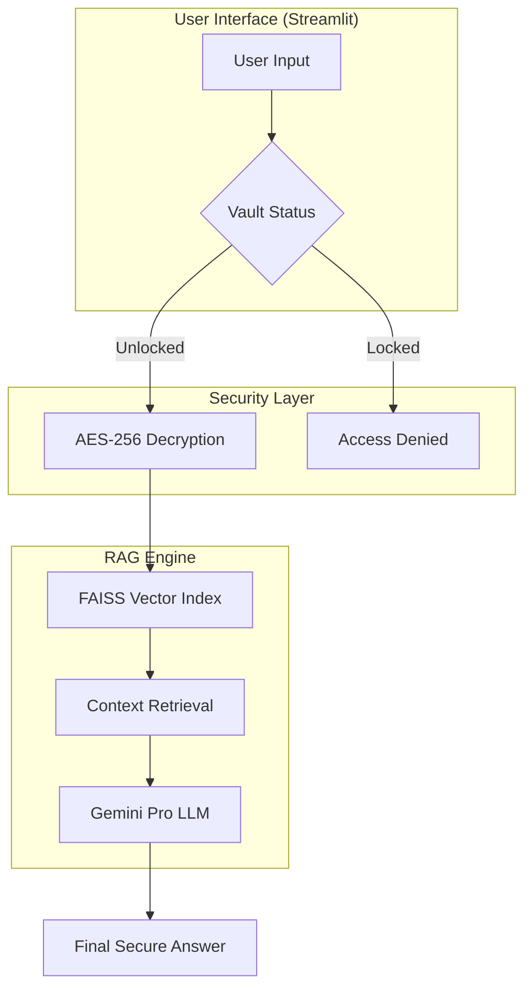

#  SecureVault AI: Privacy-Focused RAG System

A secure note-taking application implementing **Retrieval-Augmented Generation (RAG)** and **Zero-Knowledge Encryption**. This project demonstrates the integration of LLMs with local vector databases while maintaining high data privacy standards.

[](https://huggingface.co/spaces/mubi-613/SecureVault-AI)

> **Live Demo:** [SecureVault AI on Hugging Face](https://huggingface.co/spaces/mubi-613/SecureVault-AI)


## Core Implementation Features
* **Security Architecture:** Implements a hybrid model using **PBKDF2** for key derivation and **AES-256 (Fernet)** for symmetric encryption. All decryption happens strictly in-memory during session runtime.
* **Vector Search:** Uses **FAISS** and the `all-MiniLM-L6-v2` transformer model for semantic indexing. This enables local retrieval without exposing sensitive data to external APIs.
* **Resource Monitoring:** Built-in tracking for token consumption and API costs, paired with a feedback mechanism for monitoring RAG retrieval accuracy.
* **Session Management:** Automated "Zero-Knowledge" protection. If the Master PIN is lost, encrypted data is mathematically unrecoverable. 
* **Automated Security:** Includes a session-based auto-lock engine that purges decrypted data from memory after 150 seconds of inactivity.
* **Fail-Safe Recovery:** Implements a hashed **Recovery Key** system for account resets while maintaining the mathematical integrity of encrypted data.
* **Smart Exports:** Unicode-compliant PDF and DOCX generation with specialized font embedding for multi-language support.

## Engineering Challenges & Production Fixes

Deploying from a local Windows environment to **Hugging Face (Debian Linux)** required solving several infrastructure-level issues:

* **Character Encoding Fixes:** Resolved `UnicodeEncodeError` in the PDF export module by implementing a preprocessing pipeline to handle non-Latin characters in a Linux environment.
* **Binary Serialization:** Fixed `RuntimeError` issues with Streamlit's download triggers by explicitly casting file buffers to `bytes` objects to ensure consistent behavior across OS environments.
* **Version Compatibility:** Refactored the UI components to maintain stability across Streamlit versions (specifically addressing the removal of deprecated `icon` arguments in cloud deployments).

##  Technical Stack
* **UI/UX:** Streamlit (Session State & Custom CSS)
* **AI/LLM:** Google Gemini API, Sentence-Transformers, FAISS
* **Security:** Python `cryptography` library, SHA-256 hashing
* **Persistence:** JSON-based local storage

##  Installation

1. **Clone the repository:**
   ```bash
   git clone [https://github.com/mubi0613/SecureVault-AI.git](https://github.com/mubi0613/SecureVault-AI.git)
   cd SecureVault-AI

2. **Setup environment:**
   Ensure you have Python 3.9+ installed, then run:
   ```bash
   pip install -r requirements.txt

3. **Run locally:**
   ```bash
   streamlit run main.py

## Project Structure

SecureVault-AI/
*  ├── main.py               # Streamlit UI & Session Management
*  ├── vault_logic.py        # Cryptography, RAG, & File IO Logic
*  ├── requirements.txt      # Project Dependencies
*  ├── .github/workflows/    # Auto-sync to Hugging Face       
*  ├── fonts/                # Custom fonts for cross-platform PDF rendering
*  └── README.md             # Documentation

## Architecture Diagram



## Important Note on Security
This tool follows Zero-Knowledge principles. Neither the developer nor the host can recover data if the Master PIN and Recovery Key are lost.

## Usage Guide

* **Initialize:** Set your Master PIN and save your Recovery Key.
* **Create Notes:** Use the sidebar to add notes. Toggle "Mark as Secret" to apply AES-256 encryption.
* **AI Search:** Open the "Ask Your Vault" expander to query your notes using natural language.
* **Manage:** Edit or delete notes, and export them as PDF/DOCX for offline use.
* **Monitor:** Check the "AI Resources" section in the sidebar to view estimated token usage and costs.